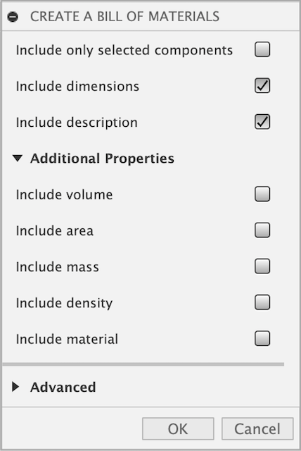
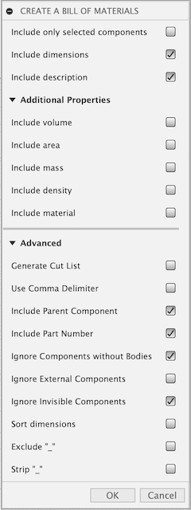
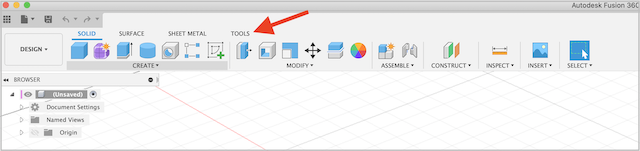
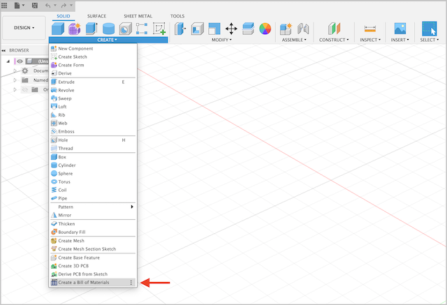

# Better-BOM
Creates a bill of material and cut lists from the browser components tree in Autodesk Fusion360. This work is derived from the amazing work of Peter; his original add-in can be found .

## General Usage Instructions
After [installation](#installation), go to the toolbar, select the "Solid" if it is not already selected. Click the "Create" submenu and choose "Create a Bill of Materials". A simplified dialog appears which shows a minimal number of options to control the output. Additional output options are available under "Additional Properties" and "Advanced". Once the required options are selected, click "OK" to save your BOM file. A dialog will popup asking for a location to save the file and the filename. Name your file and click "OK". After creating the file a message box popups with the information that the file has successfully created. You may open the file in any app that can handle CSV formatted files. 

Under "Advanced" there is an option to generate cut lists for woodworking projects. The cut list format is deisgned for the software by [Gary Darby](http://www.delphiforfun.org/Programs/CutList.htm) to optimize panel use, but this software does not appear to be supported any longer. You can also use the output with the website cutlist optimizer (https://www.cutlistoptimizer.com) with minor manipulation.

**NOTE**
If you get an error saying not all components have been loaded, try activing a subcomponent and then reactiving the top-most component.  This should force Fusion to load the subcomponents and allow the BOM to be created.

### Options

The Better-BOM addin supports many different options through two expandable areas in the main dialog window.

### Additional Properties

The additional properties section allows you to include details about the components physical attributes in the output file.

* **Include volume**
> Includes the accumulated volume for all bodies at first level whithin a component.

* **Include area**
> Includes the accumulated area for all bodies at first level whithin a component.

* **Include mass**
> Includes the accumulated mass for all bodies at first level whithin a component.

* **Include density**
> Add's the density of the first body at first level found whithin a component.

* **Include material**
> Includes the material names as an comma seperated list for all bodies at first level whithin a component.

### Advanced

* **Include only selected components**
> Only the selected components will be exported to CSV.

* **Include dimension**
> Exports the accumulated bounding box dimension of all solid bodies on first level whithin a component.

* **Include description**
> Includes the component description. To edit, right click on a component and select _Properties_ in the submenu.

* **Generate Cut List**
> Generates a file that can be used in the [cut list optimization software by Gary Darby](http://www.delphiforfun.org/Programs/CutList.htm). 
This is especially helpful in woodworking projects and allows to optimize panel use.  The file is saved under the same name as the BOM but with a "_cutList.txt" ending.

* **Use comma delimiter**
> If checked, the dot decimal delimiter will be replaced with a comma. This is useful for all countries that uses a comma for float decimal delimiters.
> As a benefit of that option, Applications like Apple Numbers, MS-Excel or OpenOffice can handle these CSV-entries as native numbers instead of simple text.

* **Include Parent Component**
> An experimental option to provide some sense of hierarchy within the component list so subcomponents can be defined and tracked.

* **Include Part Number**
> Includes the component part number. To edit, right click on a component and select _Properties_ in the submenu.

* **Ignore Components without Bodies**
> If selected, components without a body with not be included in the BOM. Deactive to include them in the output.

* **Ignore External Components**
> If selected, external components (i.e., linked) will be exclused from the output file.

* **Ignore Invisible Components**
> If selected, components that have their visibilty turned off will be exclused from the output file.

* **Sort Dimensions**
> If you are cutting your parts out of any kind of panelized material (i.e. plywood), you want the height of the part usually be the thickness of your material. 
If you select this option, the dimensions are sorted to accommodate this, no matter how your part is oriented in your model. 
The smallest value becomes the height (thickness), the next larger the width and the largest the length.

* **Exclude "_"**
> Often users sign components with an underscore to make them visually for internal use. This option ignores such signed components.
> If you deselect this option another option, and can chose to strip the "_" using the 'Strip "_"' option.

* **Strip "_"**
> Removes the leading underscore from the component name in the output file.

* ...

---

## Installation

1. Checkout the repository from [Github](https://github.com/cyberreefguru/Better-BOM) or get the ZIP-package [here](https://github.com/cyberreefguru/Better-BOM/archive/better-bom.zip)
2. If you have checked out the repo, skip to step 4
3. Extract the content of the downloaded ZIP to a preferred location
4. Open Fusion360 and select the Tools tab from the toolbar
	
5. From the Tools tab, select the Add-Ins menu option
	
6. Select "Scripts and Add-ins..." menu option
    
7. To add the Better-BOM Add-In, click on the green plus next to the "My Add-Ins" menu option
	
8. Locate the unzipped _Better-BOM_ folder, open it and choose _Better-BOM.py_ and click **OK**
9. The Add-In is now listed but not running. Select the _Better BOM_ entry and click _Run_; If you want the add-in to run each time you lauch Fusion, select the "Run on Startup" option as well
	
	

After _Run_ was clicked the Add-Ins dialog closes automatically.
Check the _Create_ toolbar and you should see the "Create a Bill of Materials" menu option.  The Better-BOM addin is ready to use.

